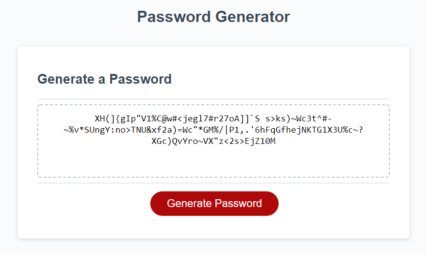

# Password Generator using JavaScript  
  
## This site showcases some of my work and my background
  
-	The program randomly generates a password that meets the users selected criteria
-	It asks the user for an input number between 8 and 128 characters for the password
-	It then asks if the user wants lowercase, uppercase, numeric, and/or special characters
-	Once it verifies that all input are correctly entered it generates the password 

## Link to the live site

  https://bdibil.github.io/Password-Generator/
  

## Screenshot

  

  
